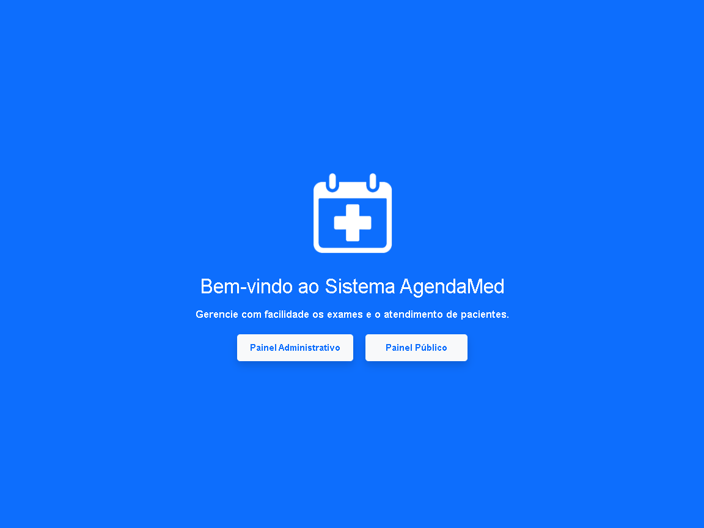
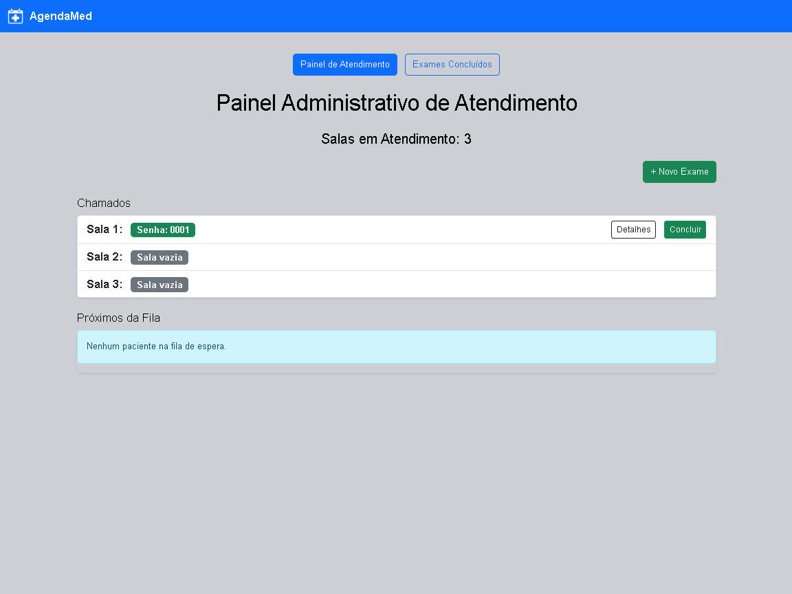
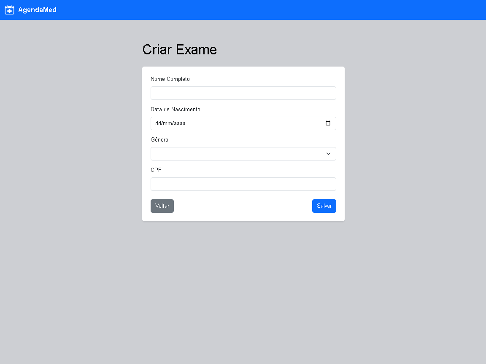
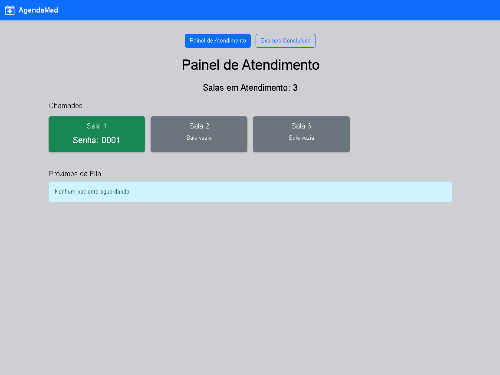

# AgendaMed

**Resumo:** Este projeto é um sistema de gerenciamento de filas para exames clínicos desenvolvido com o framework Django. A aplicação permite organizar e gerenciar o atendimento de pacientes de forma eficiente, garantindo controle e transparência no agendamento e execução dos exames em clínicas ou hospitais.

---

## Objetivo

O principal objetivo do sistema é resolver o problema da desorganização e da falta de controle nas filas de espera para exames clínicos, oferecendo uma solução digital para gerenciar pacientes. A aplicação permite a criação e o controle de múltiplos exames, com tempo de espera e atendimento em tempo real. A motivação do projeto está ligada à necessidade de modernizar o processo de triagem e atendimento em unidades de saúde, melhorando a experiência do paciente e otimizando os recursos das clínicas.

Além disso, este projeto foi desenvolvido como parte da disciplina de Estrutura de Dados, com foco na aplicação prática do conceito de filas. A lógica de atendimento utiliza estruturas de dados lineares (como filas simples), permitindo uma abordagem didática para o uso de algoritmos clássicos em um cenário do mundo real.

---

## Tecnologias Utilizadas

Liste as principais tecnologias, linguagens, frameworks e bibliotecas utilizadas:

- Python 3.12
- Django 5.2
- SQLite3
- HTML5
- Bootstrap


---

## Estrutura do Projeto

```
AgendaMed-main/
├── project_agendamed/
│   ├── exames/
│   │   ├── templates/
│   │   │   ├── base.html
│   │   │   └── exames/
│   │   ├── forms.py
│   │   ├── models.py
│   │   ├── urls.py
│   │   └── views.py
│   ├── project_agendamed/
│   ├── db.sqlite3
│   └── manage.py
├── .gitignore
├── LICENSE
└── README.md
```

---

## Como Executar

### Rodando Localmente

1. Clone o repositório:

```
git clone https://github.com/Luis-Hardt/AgendaMed-main.git
```

2. Instale as dependências:

```
pip install django
```

3. Acesse o diretório do projeto:

```
cd AgendaMed-main\project_agendamed
```

4. Execute a aplicação:

```
python manage.py runserver
```

5. Acesse a aplicação no navegador:

```
http://127.0.0.1:8000/
```

---

## Demonstrações

### Tela inicial


### Fila Administrativa


### Formulário de Exame


### Fila Pública



---

## Equipe

|      Nome       |                        GitHub                        |
|-----------------|------------------------------------------------------|
| Luis Hardt      | [@luis-hardt](https://github.com/luis-hardt)         |
| Guilherme Zanni | [@Zanniguilherme](https://github.com/Zanniguilherme) |

---

## Disciplinas Envolvidas

- Estrutura de Dados I

---

## Informações Acadêmicas

- Universidade: **Universidade Braz Cubas**
- Curso: **Ciência da Computação**
- Semestre: 3º
- Período: Noite
- Professora orientadora: **Dra. Andréa Ono Sakai**
- Evento: **Mostra de Tecnologia 1º Semestre de 2025**
- Local: Laboratório 12
- Datas: 05 e 06 de junho de 2025

---

## Licença

MIT License